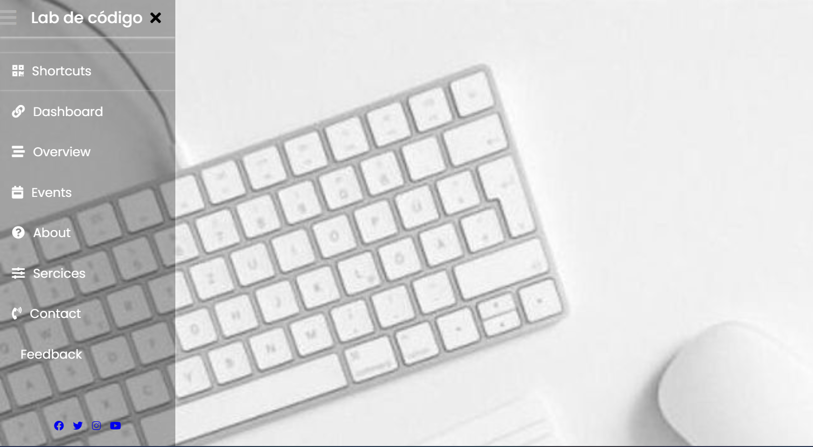

Menu da barra lateral usando HTML e CSS
-

### Referência
https://www.codingnepalweb.com/side-bar-menu-using-html-css/

"Neste programa [Menu Barra Lateral], a princípio existe um botão no canto superior esquerdo da página web, ao clicar nesse botão aparece uma barra com animação lateral do lado esquerdo que possui diversos links de navegação com ícones. Quando você passa o mouse sobre o link específico, um pequeno efeito de sombra de caixa aparecerá no fundo com uma linha branca no lado esquerdo que parece mais atraente. Há também um ícone de mídia social na parte inferior do menu lateral com efeito de foco."

-
