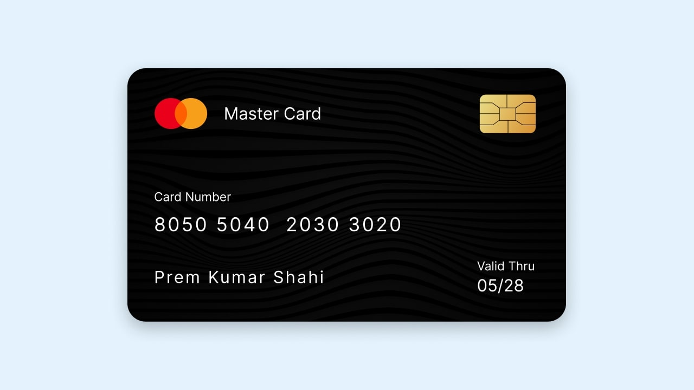

Design de interface de cartão de crédito em HTML e CSS
-

### Referência
https://www.codingnepalweb.com/credit-card-ui-design-in-html-css/

"Cartão de crédito é o meio emitido pelo banco e instituição financeira que permite ao titular do cartão adquirir bens e serviços a crédito. Existem muitos designs de cartão e seus vários tipos, como cartão master, cartão Visa, débito/crédito e assim por diante.

Dê uma olhada na imagem fornecida do nosso Cartão de Crédito. Como você pode ver na seção superior, adicionei o logotipo e o texto do cartão master, ao lado dele há um chip desse cartão, na seção intermediária está o número do cartão e abaixo dele estão o nome e a data de validade."

-
