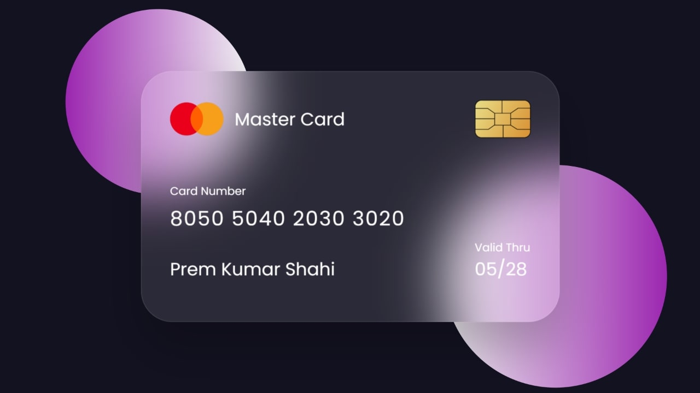

Design de UI de cartão invertido em HTML e CSS
-

### Referência
https://www.codingnepalweb.com/flipping-card-ui-design-html-css/

"Dê uma olhada na imagem fornecida do nosso projeto [Flipping Card UI Design]. Como você pode ver, há dois lindos gradientes, duas bolas e, entre elas, há um cartão com UI de Grassmorphism. No cartão, há o logotipo do cartão master, chip e alguns detalhes do proprietário do cartão, como número do cartão, nome e data de validade do cartão. A parte interessante deste projeto é que quando você passa o mouse sobre o cartão, ele desliza e o verso do cartão fica visível. No verso desse cartão, adicionei algumas outras informações também.

Para ver a demonstração real deste cartão e como ele vira e a parte traseira deste cartão, você pode assistir ao vídeo tutorial deste projeto [Flipping Card UI Design], que forneci abaixo. Depois de assistir ao vídeo tutorial fornecido, você também terá uma ideia de como todo o código HTML e CSS funciona por trás dele."

-
