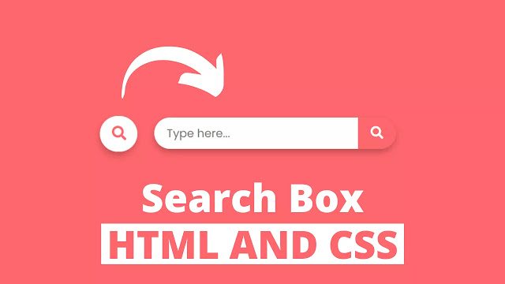

Como fazer uma caixa de pesquisa usando HTML e CSS
-

#### Referência
https://www.codingnepalweb.com/how-to-make-search-box-using-html-css/

"Como você pode ver na imagem fornecida deste programa [Responsive Search Box], este é o exemplo real de uma barra de pesquisa. A princípio, esta barra de pesquisa está em formato pequeno, literalmente, podemos ver apenas o ícone de pesquisa e quando clicamos nesse ícone de pesquisa, a caixa de pesquisa aparece suavemente com um campo de entrada."

-
