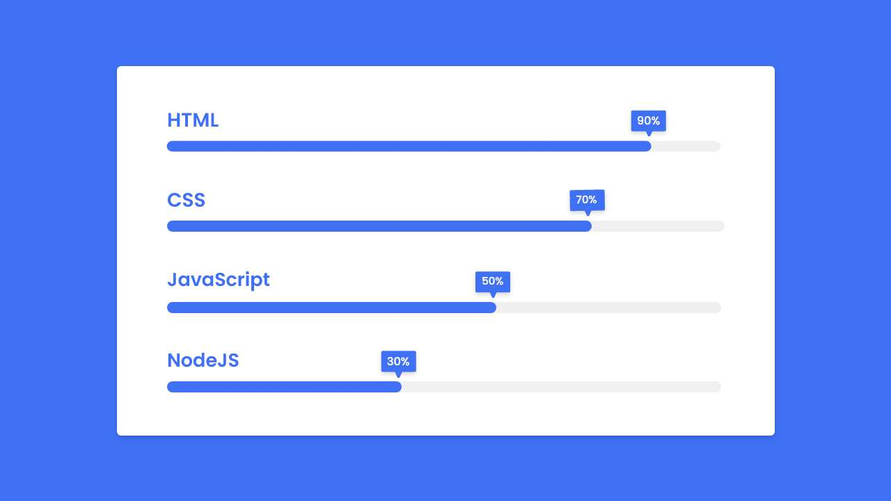

Barra de habilidades animada em HTML e CSS | Barra de progresso
-

### Referência
https://www.codingnepalweb.com/animated-skills-bar-in-html-css-progress-bar/

"Barra de Habilidades é essa combinação de diferentes habilidades que alguém possui, é como a qualificação de uma determinada pessoa para um determinado trabalho. Por exemplo, se alguém é um desenvolvedor front-end, então ele tem conhecimento de HTML, CSS, Adobe XD e JavaScript básico.

Vamos dar uma olhada rápida na imagem fornecida do nosso projeto que vamos criar [Barra de habilidades animada em HTML e CSS]. Na imagem podemos ver um total de quatro barras. Cada barra tem um título e uma porcentagem diferentes. Quando a página é atualizada ou aberta, essa porcentagem de habilidade é animada."

-

