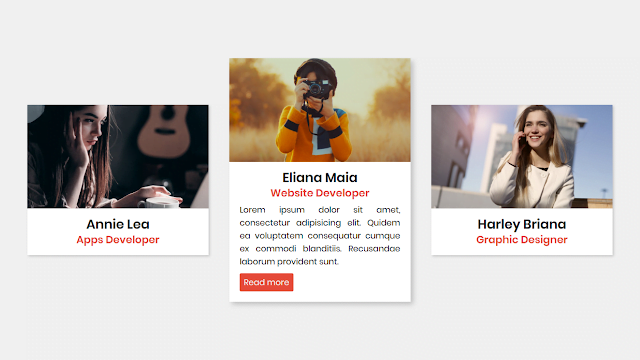

Design de cartão CSS responsivo com animação flutuante em HTML e CSS
-

### Referência
https://www.codingnepalweb.com/responsive-css-cards-design/

"Um cartão é um pequeno módulo retangular com imagens e texto. Para equilibrar a usabilidade da interface, o design da interface do cartão é uma escolha padrão. Como os cartões são fáceis de usar, eles também podem exibir conteúdo que contém detalhes diferentes."

-
