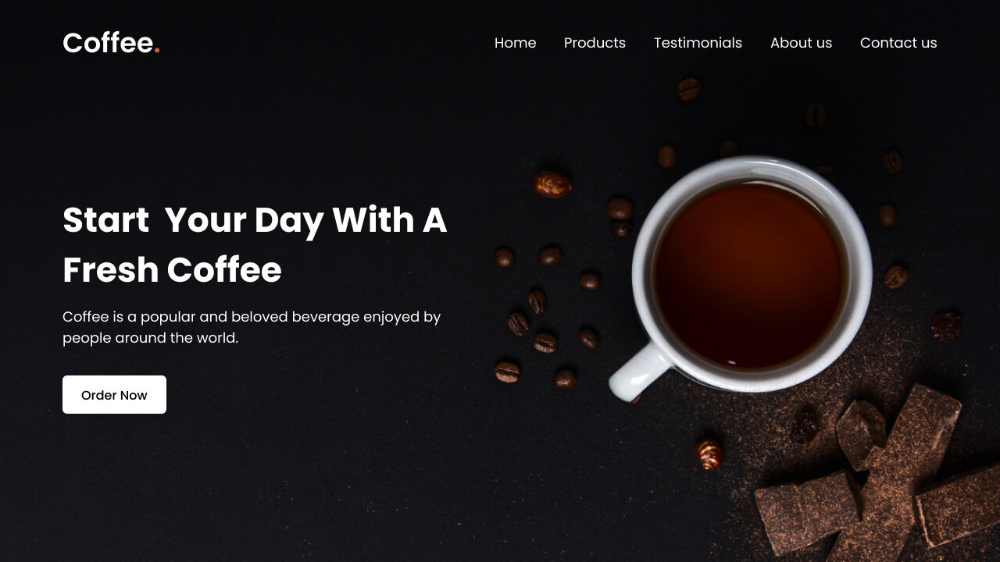

Crie um site de café responsivo em HTML e CSS
-

### Referência
https://www.codingnepalweb.com/create-responsive-coffee-website-html-css/

"Para criar nosso site de café, usaremos elementos HTML comuns como cabeçalho, barra de navegação (nav), ul, li, a e botão, junto com algumas propriedades CSS básicas para estilizar e tornar nosso site responsivo e atraente. Portanto, como iniciante, você não deverá ter problemas para seguir as etapas e entender os códigos."

-
