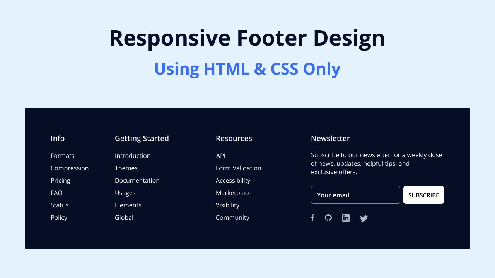

Crie uma seção de rodapé responsiva em HTML e CSS
-

### Referência

"Para criar um rodapé , usaremos elementos HTML comumente usados, como rodapé, h4, ul, li, a e botão, junto com algumas propriedades CSS básicas para estilizar e tornar o rodapé responsivo. Portanto, você não deverá ter problemas para acompanhar e compreender os códigos."

-

