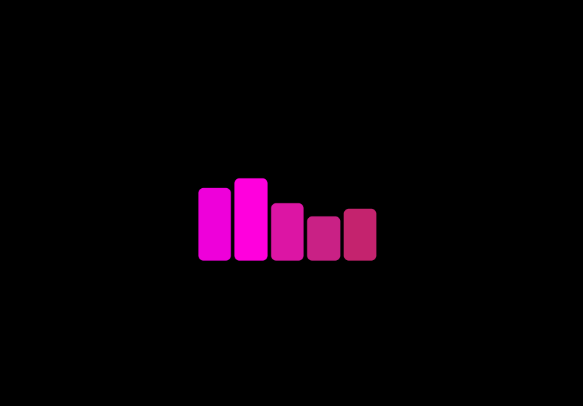

Crie uma animação de carregamento de música em HTML e CSS

-
### Referência
https://www.codingnepalweb.com/create-music-loading-animation-in-html-css/

"Uma animação de carregamento musical é uma forma criativa de adicionar um elemento divertido e interativo à sua interface de usuário. Pode ser tão simples quanto uma barra de progresso que muda de cor ou forma de acordo com a música, ou tão complexo quanto uma animação completa que conta uma história enquanto o usuário espera."

-

