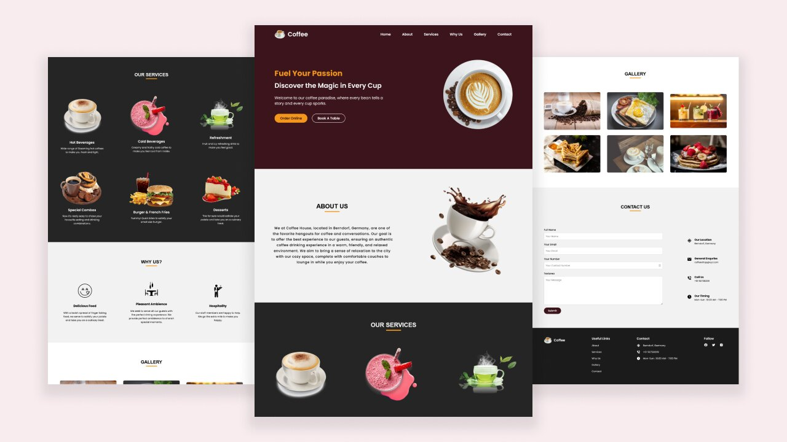

Crie um site de café responsivo em HTML e CSS
-

### Referência
https://www.codingnepalweb.com/create-responsive-coffee-website-html-and-css/

"Nesta postagem do blog, orientarei você nas etapas para criar um site bonito e responsivo com o tema café usando HTML e CSS . O site incluirá várias seções, como Página inicial, Sobre, Serviços, Por que somos, Galeria, Contato e rodapé. Uma das melhores características deste site é sua total capacidade de resposta, garantindo uma ótima aparência em dispositivos móveis e desktops.

Especialmente em dispositivos móveis, adicionaremos um menu hambúrguer ao cabeçalho para alternar o menu de navegação móvel quando clicado. Isso será conseguido usando a entrada de caixa de seleção HTML com elementos de rótulo, sem depender de JavaScript ."

-

